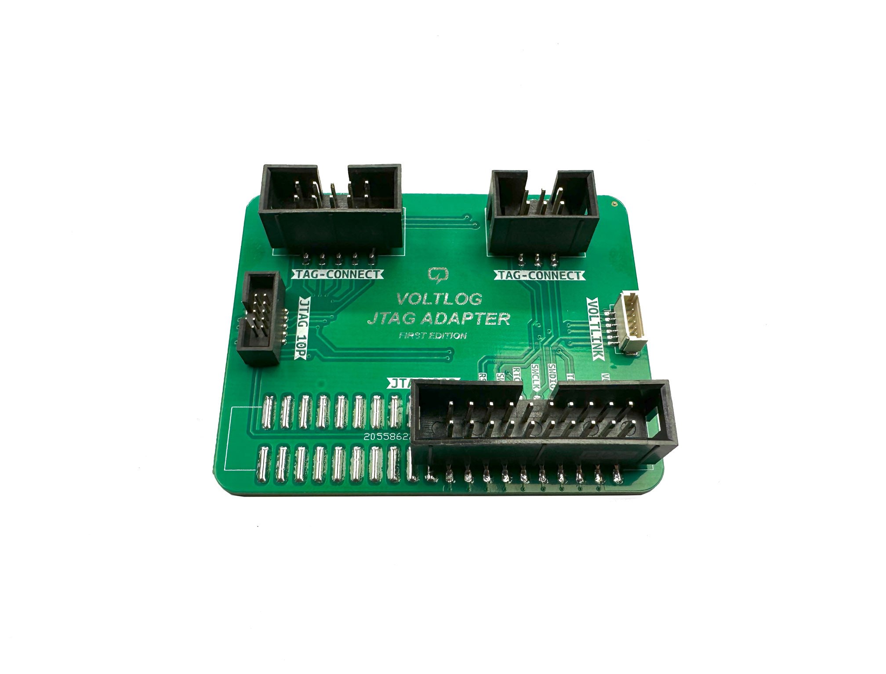

# TagConnect to ST-Link/J-Link JTAG Adapter PCB
I designed this adapter PCB to alow easy connection of the standard TC2030 or TC2050 TagConnect series programming cables to the popular programming/debugging tools like the ST-Link or J-Link which feature a different connector.

Additionally a 6-pin VoltLink connector™ has been added so that a standard TC2030 footprint on a PCB can be used to interface to the VoltLink USB to serial adapter.

If you would like to order one of these adapters ready assembled, check out my [Tindie store](https://voltlog.com/y/tagco).

More info about this project in [Voltlog #460](https://youtu.be/9-e_gcYaEM0).

